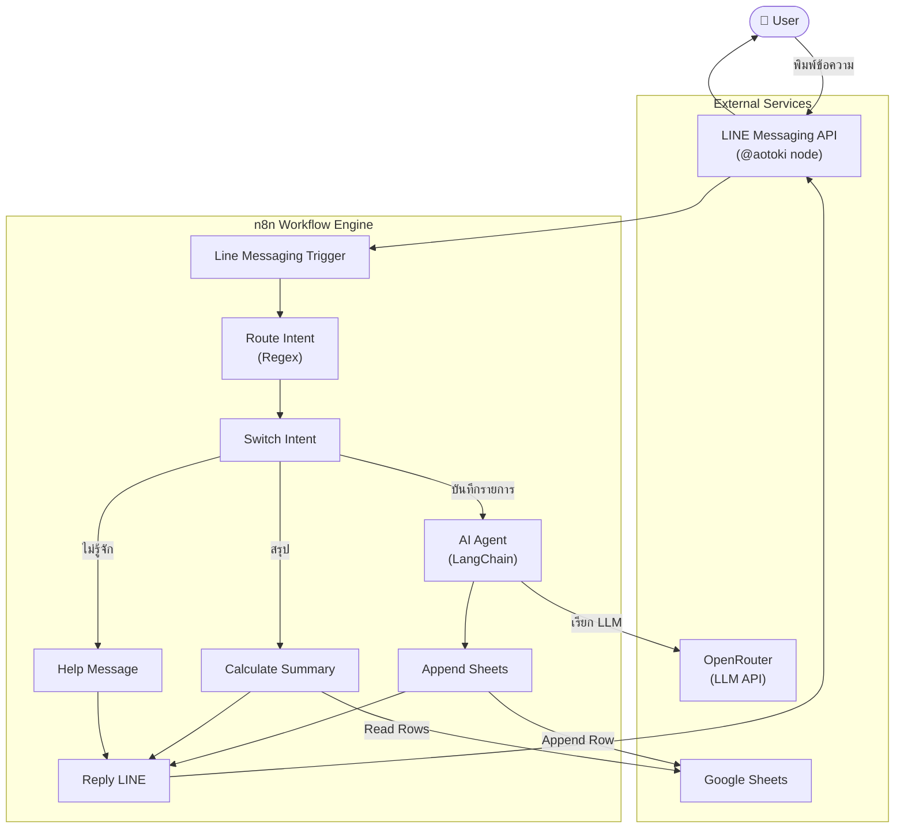
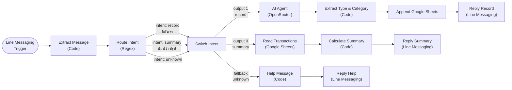
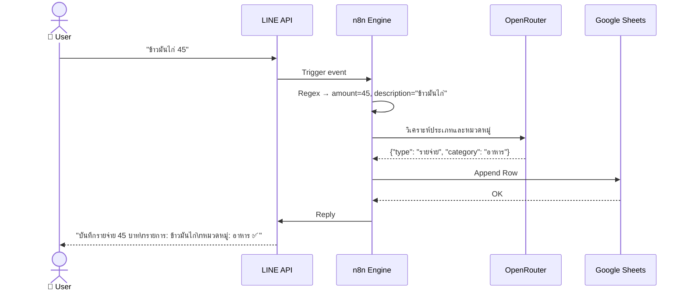
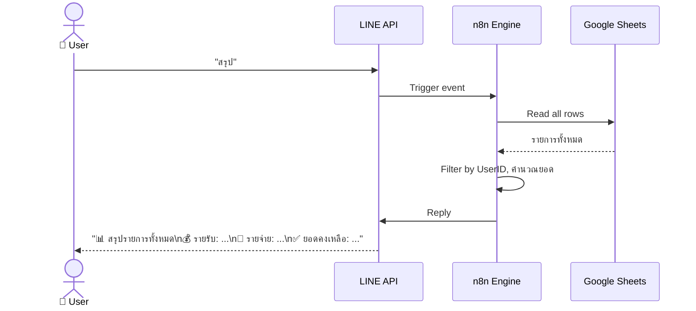

# Automated Income & Expense Tracker

> ระบบบันทึกรายรับ-รายจ่ายอัตโนมัติผ่าน LINE + n8n + LLM + Google Sheets

---

## Problem Statement

| | |
|---|---|
| **WHO** | ผู้ใช้ทั่วไปและธุรกิจขนาดเล็กที่ต้องการบริหารการเงิน |
| **WHAT** | บันทึกรายการด้วยมือยุ่งยาก ข้อมูลผิดพลาด ขาดการจัดหมวดหมู่ที่ถูกต้อง |
| **WHEN** | ทุกวันที่มีการใช้จ่ายหรือรับเงิน |
| **HOW MUCH** | เสียเวลาหลายนาทีต่อรายการ + ความเสี่ยงจัดหมวดหมู่ผิดพลาด |

---

## Solution

สร้าง **Automated Income & Expense Tracker** ที่ให้ผู้ใช้พิมพ์ข้อความสั้น ๆ ผ่าน LINE
แล้วระบบใช้ **LLM วิเคราะห์ประเภทและจัดหมวดหมู่อัตโนมัติ** บันทึกลง Google Sheets และสรุปรายงานได้ทันที — ไม่ต้องเลือกหมวดหมู่หรือเปิดแอปอื่นเพิ่ม

---

## System Architecture

### High-Level Overview



---

### Workflow Detail — realtime-tracker.json



---

### Sequence — บันทึกรายการ



---

### Sequence — ดูสรุป



---

## Tech Stack

| เครื่องมือ | บทบาท |
|---|---|
| **n8n** | Workflow Automation Engine หลัก |
| **@aotoki/n8n-nodes-line-messaging** | LINE Trigger และ Reply node สำหรับ n8n |
| **OpenRouter API** | Gateway สำหรับเรียก LLM |
| **@n8n/n8n-nodes-langchain.lmChatOpenRouter** | Chat Model node เชื่อมต่อ OpenRouter |
| **n8n AI Agent Node** | วิเคราะห์ประเภทและหมวดหมู่ผ่าน LangChain Agent |
| **Google Sheets API** | ฐานข้อมูลบันทึกรายการ |
| **Switch Node** | แยก intent (บันทึก / สรุป / ไม่รู้จัก) |
| **Code Node** | Regex parse, คำนวณสรุป, สร้าง reply message |

---

## Workflow Nodes Summary

| Node | Type | หน้าที่ |
|---|---|---|
| Line Messaging Trigger | lineMessagingTrigger | รับ event จาก LINE |
| Extract Message | Code | ดึง text, replyToken, userId |
| Route Intent | Code | Regex แยก intent: record / summary / unknown |
| Switch Intent | Switch | แยก flow ตาม intent |
| AI Agent | LangChain Agent | วิเคราะห์ประเภทและหมวดหมู่ด้วย LLM |
| OpenRouter Chat Model | lmChatOpenRouter | LLM model via OpenRouter |
| Extract Type & Category | Code | Parse JSON output จาก AI Agent |
| Append Google Sheets | Google Sheets | บันทึกรายการลง sheet |
| Read Transactions | Google Sheets | อ่านรายการทั้งหมดเพื่อสรุป |
| Calculate Summary | Code | Filter by UserID, คำนวณรายรับ/รายจ่าย/ยอดคงเหลือ |
| Help Message | Code | สร้างข้อความแนะนำวิธีใช้งาน |
| Reply Record | lineMessaging | ส่ง reply กรณีบันทึกรายการ |
| Reply Summary | lineMessaging | ส่ง reply กรณีขอสรุป |
| Reply Help | lineMessaging | ส่ง reply กรณีไม่รู้จักคำสั่ง |

---

## LLM Categorization

ระบบส่ง description และ amount ให้ AI Agent วิเคราะห์ทั้งประเภทและหมวดหมู่พร้อมกัน และตอบกลับในรูปแบบ JSON

| ประเภท | หมวดหมู่ที่รองรับ |
|---|---|
| **รายรับ** | เงินเดือน, ขายสินค้า, ค่าจ้าง, โบนัส, ดอกเบี้ย, ลงทุน, อื่น ๆ |
| **รายจ่าย** | อาหาร, เดินทาง, ที่พัก, สุขภาพ, บันเทิง, ช้อปปิ้ง, ค่าน้ำค่าไฟ, การศึกษา, อื่น ๆ |

---

## Message Format

พิมพ์ข้อความที่มีตัวเลขและคำบอกรายการ — ไม่ต้องใส่คำนำหน้า ระบบ AI วิเคราะห์ให้เอง

| ตัวอย่างข้อความ | AI วิเคราะห์ |
|---|---|
| `ข้าวมันไก่ 45` | รายจ่าย / อาหาร |
| `Grab ไปสนามบิน 350` | รายจ่าย / เดินทาง |
| `รับเงินเดือน 15000` | รายรับ / เงินเดือน |
| `ค่าทำเว็บไซต์ 5000` | รายรับ / ค่าจ้าง |
| `Netflix 179` | รายจ่าย / บันเทิง |
| `สรุป` | แสดงสรุปรายการทั้งหมดของ user |

---

## Google Sheets Structure

Sheet: **Transactions**

| Date | Time | Type | Amount | Description | Category | UserID |
|------|------|------|--------|-------------|----------|--------|
| 06/04/2569 | 12:30 | รายจ่าย | 45 | ข้าวมันไก่ | อาหาร | U5d67aa9... |

---

## Repository Structure

```
automated-expense-tracker/
│
├── workflows/
│   └── realtime-tracker.json     # n8n workflow หลัก
│
├── sheets/
│   └── template.xlsx             # Template Google Sheets
│
├── docs/
│   ├── setup-guide.md            # คู่มือติดตั้งและตั้งค่าระบบ
│   ├── line-setup.md             # วิธีสร้าง LINE Bot และตั้งค่า Webhook
│   └── message-format.md         # รูปแบบข้อความที่ระบบรองรับ
│
├── Project_Proposal.md
└── README.md
```

---

## Getting Started

### สิ่งที่ต้องเตรียม

- **n8n** — self-hosted หรือ n8n Cloud (v2.2.6+)
- **LINE Developers Account** — สร้าง Messaging API Channel
- **@aotoki/n8n-nodes-line-messaging** — ติดตั้ง community node ใน n8n
- **OpenRouter API Key** — สมัครที่ openrouter.ai
- **Google Account** — เปิดใช้ Google Sheets API

### ขั้นตอน

1. Clone repository นี้
2. ติดตั้ง community node `@aotoki/n8n-nodes-line-messaging` ใน n8n
3. Import `workflows/realtime-tracker.json` เข้า n8n
4. ตั้งค่า Credentials ใน n8n:
   - **Line Messaging account** — LINE Channel Access Token
   - **OpenRouter account** — OpenRouter API Key
   - **Google Sheets account** — Google Sheets OAuth2
5. แก้ Google Sheet ID ใน workflow ให้ตรงกับ Sheet ของคุณ
6. ตั้งค่า Webhook URL ใน LINE Developers Console
7. ทดสอบส่งข้อความผ่าน LINE

---

## Team

| ชื่อ | รหัสนักศึกษา |
|---|---|
| นายสุธา ทองคง | 66025690 |
| นายคุณาธิป อู่ทอง | 66033050 |
| นายประธาน นิลสนธิ์ | 66031043 |
| นายนนท์ธีร์ ปานะถึก | 66073169 |

---

## Workflow Documentation

### System Architecture


---

### Workflow Detail — realtime-tracker.json


---

### Workflow Nodes Summary

| Node | Type | หน้าที่ |
|---|---|---|
| Line Messaging Trigger | lineMessagingTrigger | รับ event จาก LINE |
| Extract Message | Code | ดึง text, replyToken, userId |
| Route Intent | Code | Regex แยก intent: record / summary / unknown |
| Switch Intent | Switch | แยก flow ตาม intent |
| AI Agent | LangChain Agent | วิเคราะห์ประเภทและหมวดหมู่ด้วย LLM |
| OpenRouter Chat Model | lmChatOpenRouter | LLM model via OpenRouter |
| Extract Type & Category | Code | Parse JSON output จาก AI Agent |
| Append Google Sheets | Google Sheets | บันทึกรายการลง sheet |
| Read Transactions | Google Sheets | อ่านรายการทั้งหมดเพื่อสรุป |
| Calculate Summary | Code | Filter by UserID, คำนวณรายรับ/รายจ่าย/ยอดคงเหลือ |
| Help Message | Code | สร้างข้อความแนะนำวิธีใช้งาน |
| Reply Record | lineMessaging | ส่ง reply กรณีบันทึกรายการ |
| Reply Summary | lineMessaging | ส่ง reply กรณีขอสรุป |
| Reply Help | lineMessaging | ส่ง reply กรณีไม่รู้จักคำสั่ง |

---

### Message Format

| ตัวอย่างข้อความ | AI วิเคราะห์ |
|---|---|
| `ข้าวมันไก่ 45` | รายจ่าย / อาหาร |
| `Grab ไปสนามบิน 350` | รายจ่าย / เดินทาง |
| `รับเงินเดือน 15000` | รายรับ / เงินเดือน |
| `ค่าทำเว็บไซต์ 5000` | รายรับ / ค่าจ้าง |
| `Netflix 179` | รายจ่าย / บันเทิง |
| `สรุป` | แสดงสรุปรายการทั้งหมดของ user |

---

### Google Sheets Structure

Sheet: **Transactions**

| Date | Time | Type | Amount | Description | Category | UserID |
|------|------|------|--------|-------------|----------|--------|
| 06/04/2569 | 12:30 | รายจ่าย | 45 | ข้าวมันไก่ | อาหาร | U5d67aa9... |
