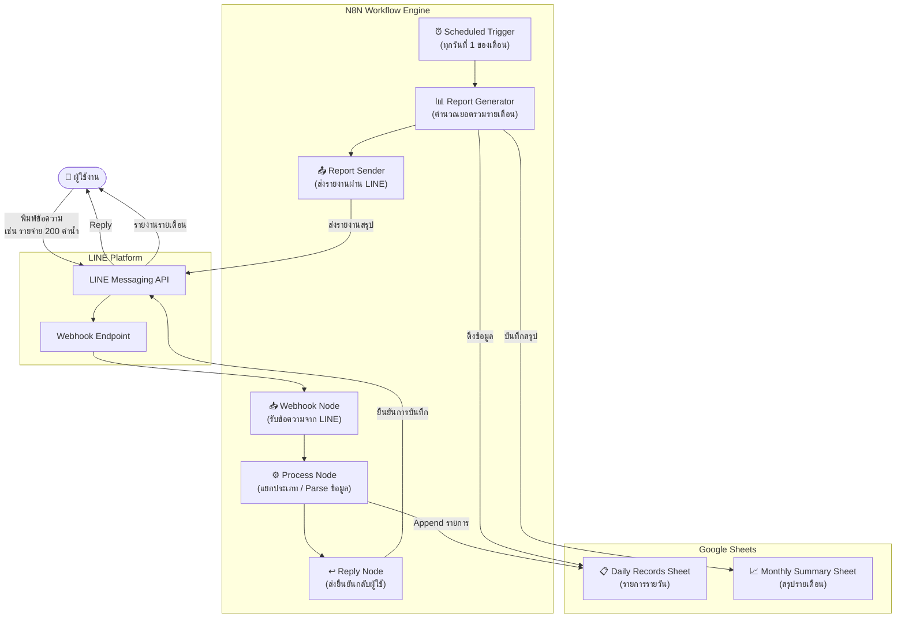
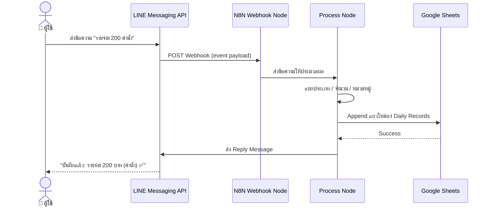
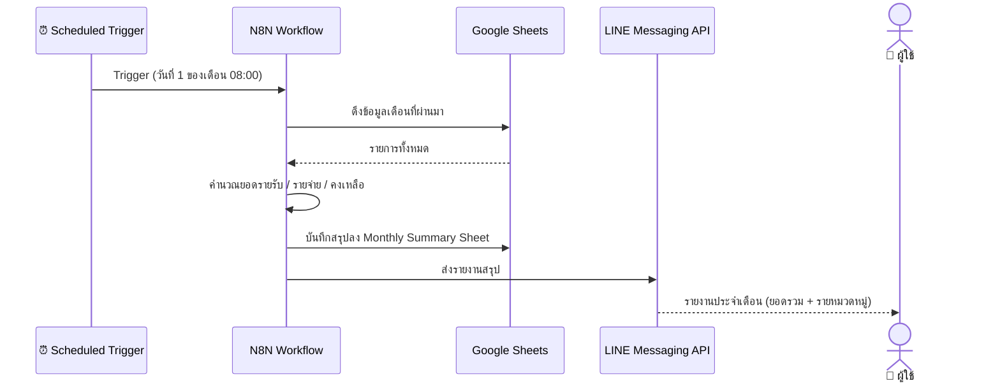

# 💰 Automated Income & Expense Tracker

ระบบบันทึกรายรับ-รายจ่ายอัตโนมัติผ่าน LINE พัฒนาด้วย N8N Workflow Automation เชื่อมต่อกับ Google Sheets เพื่อช่วยให้ผู้ใช้งานทั่วไปและธุรกิจขนาดเล็กสามารถบริหารจัดการการเงินได้อย่างสะดวก แม่นยำ และเป็นระบบ

---

## 🔍 Problem & Solution

### ปัญหา (Problem)
การบันทึกรายรับ-รายจ่ายในปัจจุบันยังพึ่งพาการจดบันทึกด้วยมือหรือแอปพลิเคชันที่ซับซ้อน ส่งผลให้เกิดปัญหาหลัก ได้แก่

- ผู้ใช้มักลืมบันทึกรายการ เนื่องจากต้องเปิดแอปแยกและกรอกข้อมูลหลายขั้นตอน
- การจดด้วยมือเสี่ยงต่อความผิดพลาดและข้อมูลสูญหาย
- ขาดรายงานสรุปรายเดือนที่ชัดเจนและเข้าถึงได้ง่าย
- ไม่มีระบบแจ้งเตือนหรือติดตามยอดแบบเรียลไทม์

### แนวทางแก้ไข (Solution)
พัฒนาระบบ Automation ที่ให้ผู้ใช้บันทึกข้อมูลผ่าน **LINE** ซึ่งเป็นแอปพลิเคชันที่คุ้นเคยในชีวิตประจำวัน โดยข้อมูลจะถูกบันทึกลง **Google Sheets** โดยอัตโนมัติ และระบบจะสร้างรายงานสรุปรายเดือนพร้อมส่งกลับให้ผู้ใช้โดยไม่ต้องดำเนินการใด ๆ เพิ่มเติม

---

## 🏗️ System Architecture

### Overview Diagram



### Data Flow — บันทึกรายการ (Real-time)



### Data Flow — รายงานสรุปรายเดือน (Scheduled)



---

## ✨ Features

- **บันทึกง่าย ผ่าน LINE** — พิมพ์ข้อความสั้น ๆ เช่น `รายรับ 500 ขายสินค้า` ระบบจัดการให้ทันที
- **บันทึกอัตโนมัติลง Google Sheets** — ไม่ต้องกรอกเองทุกครั้ง ข้อมูลถูก Append ต่อท้ายอัตโนมัติ
- **รองรับหมวดหมู่รายการ** — อาหาร, เดินทาง, สาธารณูปโภค, รายได้จากงาน ฯลฯ
- **รายงานสรุปรายเดือนอัตโนมัติ** — ระบบส่งรายงานยอดรวมทุกต้นเดือนผ่าน LINE โดยไม่ต้องร้องขอ
- **เข้าถึงข้อมูลได้ทุกอุปกรณ์** — ข้อมูลทั้งหมดเก็บใน Google Sheets

---

## 🛠️ Tech Stack

| เครื่องมือ | บทบาทในระบบ |
|---|---|
| **N8N** | Workflow Automation Engine หลัก |
| **LINE Messaging API** | ช่องทางรับ-ส่งข้อความกับผู้ใช้ |
| **Google Sheets API** | ฐานข้อมูลและรายงานสรุป |
| **Webhook Node (N8N)** | รับ Trigger จาก LINE |
| **Scheduled Trigger (N8N)** | รันสรุปรายงานอัตโนมัติรายเดือน |

---

## 📁 Repository Structure

```
personal-accounting/
├── workflows/
│   ├── line-webhook.json          # N8N workflow: รับและบันทึกรายการจาก LINE
│   └── monthly-report.json        # N8N workflow: สรุปรายงานประจำเดือน
├── sheets/
│   └── template.xlsx              # Template Google Sheets (Daily + Monthly)
├── docs/
│   ├── setup-guide.md             # คู่มือการติดตั้งและตั้งค่าระบบ
│   ├── line-message-format.md     # รูปแบบข้อความที่รองรับ
│   └── screenshots/               # รูปภาพตัวอย่างการใช้งาน
├── Project_Proposal.md
└── README.md
```

---

## 🚀 Getting Started

### สิ่งที่ต้องเตรียม

1. **N8N** — ติดตั้ง self-hosted หรือใช้ N8N Cloud
2. **LINE Developers Account** — สร้าง Messaging API Channel
3. **Google Account** — เปิดใช้งาน Google Sheets API และสร้าง Service Account

### ขั้นตอนการติดตั้ง

1. Clone repository นี้
2. Import workflow จากโฟลเดอร์ `workflows/` เข้า N8N
3. ตั้งค่า Credentials ใน N8N (LINE Token + Google Sheets)
4. ตั้งค่า Webhook URL ใน LINE Developers Console
5. Copy `sheets/template.xlsx` ไปยัง Google Drive และแชร์ให้ Service Account
6. ทดสอบส่งข้อความผ่าน LINE

> ดูรายละเอียดเพิ่มเติมได้ที่ [docs/setup-guide.md](docs/setup-guide.md)

---

## 💬 รูปแบบข้อความที่รองรับ

| รูปแบบ | ตัวอย่าง | หมายเหตุ |
|---|---|---|
| รายรับ | `รายรับ 500 ขายสินค้า` | ระบุจำนวนเงินและรายละเอียด |
| รายจ่าย | `รายจ่าย 200 ค่าน้ำ` | ระบุจำนวนเงินและรายละเอียด |
| ดูยอด | `ยอด` | ดูยอดคงเหลือปัจจุบัน |

---

## 👨‍💻 Team

| ชื่อ | รหัสนักศึกษา |
|---|---|
| นายสุธา ทองคง | 66025690 |
| นายคุณาธิป อู่ทอง | 66033050 |
| นายประธาน นิลสนธิ์ | 66031043 |
| นายนนท์ธีร์ ปานะถึก | 66073169 |
