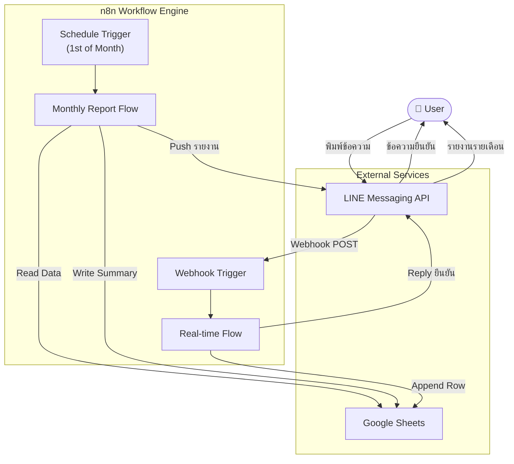
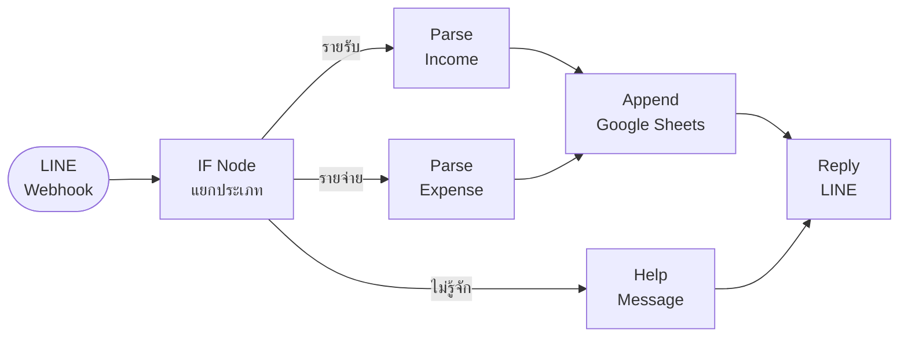
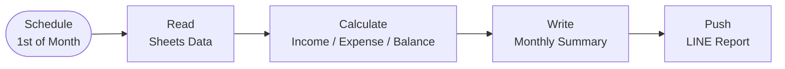
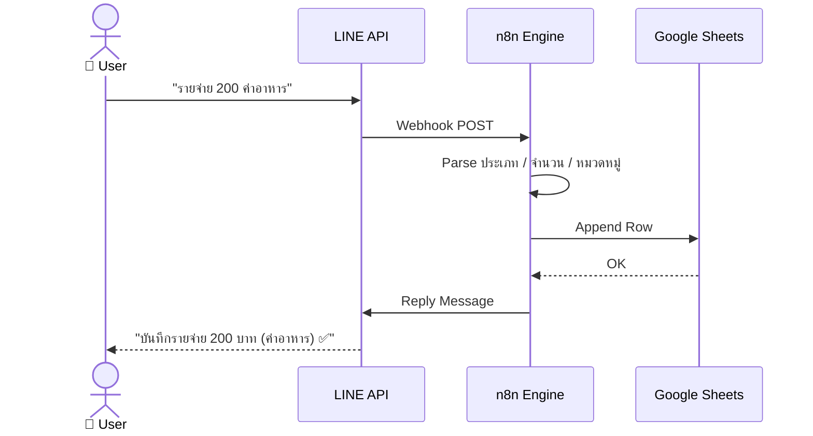
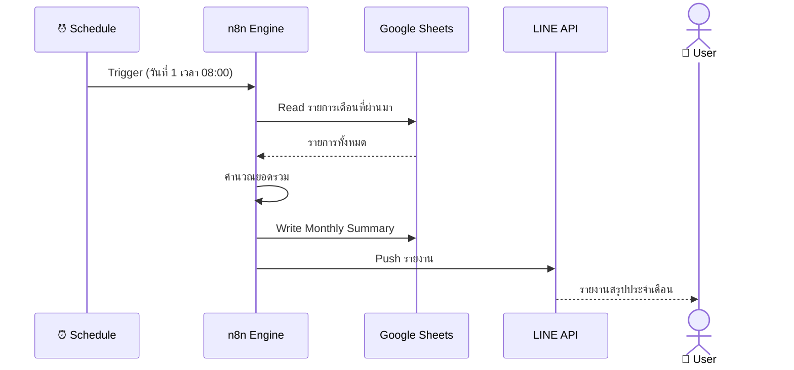

# Automated Income & Expense Tracker

> ระบบบันทึกรายรับ-รายจ่ายอัตโนมัติผ่าน LINE + n8n + Google Sheets

---

## Problem Statement

| | |
|---|---|
| **WHO** | ผู้ใช้ทั่วไปและธุรกิจขนาดเล็กที่ต้องการบริหารการเงิน |
| **WHAT** | บันทึกรายการด้วยมือยุ่งยาก ข้อมูลผิดพลาด ขาดรายงานสรุป |
| **WHEN** | ทุกวันที่มีการใช้จ่ายหรือรับเงิน |
| **HOW MUCH** | เสียเวลาหลายนาทีต่อรายการ + ความเสี่ยงบริหารงบประมาณผิดพลาด |

---

## Solution

สร้าง **Automated Income & Expense Tracker** ที่ให้ผู้ใช้พิมพ์ข้อความสั้น ๆ ผ่าน LINE
แล้วระบบบันทึกและสรุปรายงานให้อัตโนมัติ — ไม่ต้องเปิดแอปอื่นเพิ่ม

---

## System Architecture

### High-Level Overview



---

### Real-time Flow (บันทึกรายการ)



---

### Monthly Report Flow (สรุปรายเดือน)



---

### Sequence — บันทึกรายการ Real-time



---

### Sequence — รายงานสรุปรายเดือน



---

## Tech Stack

| เครื่องมือ | บทบาท |
|---|---|
| **n8n** | Workflow Automation Engine หลัก |
| **LINE Messaging API** | ช่องทางรับ-ส่งข้อความกับผู้ใช้ |
| **Google Sheets API** | ฐานข้อมูลและรายงานสรุป |
| **Webhook Node** | รับ Trigger จาก LINE |
| **IF Node** | แยกประเภทรายการ |
| **Code Node** | ประมวลผลและจัดรูปแบบข้อมูล |
| **Schedule Trigger** | รันสรุปรายงานอัตโนมัติรายเดือน |

---

## Repository Structure

```
automated-expense-tracker/
│
├── workflows/
│   ├── realtime-tracker.json     # n8n workflow: บันทึกรายการ real-time
│   └── monthly-report.json       # n8n workflow: สรุปรายงานรายเดือน
│
├── sheets/
│   └── template.xlsx             # Template Google Sheets (Daily + Monthly)
│
├── docs/
│   ├── setup-guide.md            # คู่มือติดตั้งและตั้งค่าระบบ
│   ├── line-setup.md             # วิธีสร้าง LINE Bot และตั้งค่า Webhook
│   └── message-format.md         # รูปแบบข้อความที่ระบบรองรับ
│
├── Project_Proposal.md
└── README.md
```

---

## Getting Started

### สิ่งที่ต้องเตรียม

- **n8n** — self-hosted หรือ n8n Cloud
- **LINE Developers Account** — สร้าง Messaging API Channel
- **Google Account** — เปิดใช้ Google Sheets API + Service Account

### ขั้นตอน

1. Clone repository นี้
2. Import workflows จาก `workflows/` เข้า n8n
3. ตั้งค่า Credentials ใน n8n (LINE Channel Access Token + Google Sheets)
4. ตั้งค่า Webhook URL ใน LINE Developers Console
5. Copy `sheets/template.xlsx` ไปยัง Google Drive และแชร์ให้ Service Account
6. ทดสอบส่งข้อความผ่าน LINE

> ดูรายละเอียดเพิ่มเติมได้ที่ [docs/setup-guide.md](docs/setup-guide.md)

---

## Message Format

| รูปแบบ | ตัวอย่าง |
|---|---|
| บันทึกรายรับ | `รายรับ 500 ขายสินค้า` |
| บันทึกรายจ่าย | `รายจ่าย 200 ค่าอาหาร` |
| ดูยอดคงเหลือ | `ยอด` |

---

## Team

| ชื่อ | รหัสนักศึกษา |
|---|---|
| นายสุธา ทองคง | 66025690 |
| นายคุณาธิป อู่ทอง | 66033050 |
| นายประธาน นิลสนธิ์ | 66031043 |
| นายนนท์ธีร์ ปานะถึก | 66073169 |
